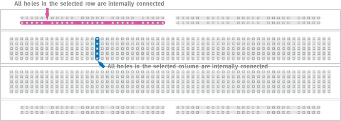
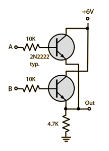
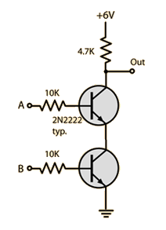
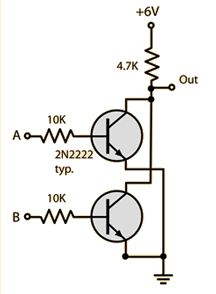

# Unit 3: Data and logic

## What is data?

Ultimately everything in a computer is reduced to either the presence or absence of an electrical charge. This electrical charge inside transistors is scaled up to form basic circuits that can be used to remember information (ie: act as memory) and perform calculations.

At the heart of it all is the transistor which is a simple electrical switch that can be turned on or off via an electrical signal. A modern Intel CPU has about 1.75 billion transistors in a piece of silicon the size of a fingernail, or 17.185 million transistors per square millimetre. (1)

## The logic gates

We mentioned before that at the most simple level, everything inside a microprocessor is reduced to transistors. But what exactly is a transistor? how does it function? How can such a simple device create the seeming complexity of modern computers?

A transistor is a switch that controls another switch. For a great introduction to how transistors can be combined to create interesting functionality, watch this brief video...

    Relays and Logic Gates - How to Make a Computer: Part I (6:30)
    [https://www.youtube.com/watch?v=fB85NrUBBhQ](https://www.youtube.com/watch?v=fB85NrUBBhQ)

This video introduced you to logic gates. This is the level of complexity from the transistor. We use multiple transistors to build logic gates. Multiple logic gates can then be used in clever patterns to create memory and perform calculations. Once we have the ability to store values in memory, and to be able to perform calculations on those values, we then have the basic building blocks of every computer.

There are 6 logic gates we will study in this course.

* NOT gate
* AND gate
* OR gate
* NAND gate
* NOR gate
* XOR gate

These gates are effectively switches, where the state of the output (whether it is on or off) is determined by the combination of the inputs and the rule of the gate.

* The NOT gate has one input and one output. If the input is on, the output is off. If the input is off, the output will be on.
* The AND gate has two inputs and one output. If both inputs are on, the output will be on. In all other cases, the output is off.
* The OR gate has two inputs and one output. If either one of the inputs is on, the output will be on. If both inputs are off, the output will be off.
* The NAND gate is a concatenation of an AND gate where the output goes through a NOT gate. This means if both inputs are on, the output will be off. In all other cases, the output is on.
* The NOR gate is a concatenation of an OR gate where the output goes through a NOT gate. This means if either input is on, the output will be off. If both inputs are off, the output will be on.
* The XOR gate is known as the eXclusive OR gate. With this gate if one of the inputs are on, the output is on. However, if both inputs are on, the output remains off. Likewise if both inputs are off, the output remains off.

We will use combinations of these logic gates to create logic circuits. To enable us to do this easily each gate has a symbol by which it can be represented in a diagram, and there is also a couple of notations available to represent them in the form of written equations. 

The logic gate symbols are shown below and are also in page 26 of your text (the XNOR gate is not part of your course but it should be an intuitive extension to determine what it is...?)

As you can also see, we can simplify our understanding of rules for each gate by using a table, known as a truth table, to document the circumstances in which a gate is on or off. Rather than using the "on" and "off" terminology, we use binary where 0 represents off and 1 represents on.

## Exercise: Creating gates from transistors

We are going to see how logic gates can be physically constructed from simple transitors.

To do this we are going to use a breadboard. It is a simple device that allows us to connect the wires (terminals) of various electronic components together in a simple fashion without having to bother with soldering.

The lines marked above show you how the pin holes on the breadboard are interconnected. This means we can put two pins in the same center row and they will become electrically connected.  This allows us to combine components together to make a circuit as the following demonstrates.

Follow the light green shading on the above. That is the path the electricity is travelling.

Before going any further you should build the simple push-button and LED scenario sketched out above to test your understanding of how the breadboard functions.

Once you have completed the LED/button exericse, it is time to attempt to wire up some logic gates.

We will be using NPN transistors for our exercise. The NPN transistor is designed to pass electrons from the emitter to the collector (so conventional current flows from collector to emitter). The emitter "emits" electrons into the base, which controls the number of electrons the emitter emits. ... The transistor is kind of like an electron valve. (https://learn.sparkfun.com/tutorials/transistors/all)

The following shows you how the diagram symbol for an NPN transistor correlates to it's physical appearance. You will need to get the order of the pins correct for your circuit to function.

Finally, the following are the transistor wiring diagrams for four of the core logic gates. Can you tell which one should be which? By the way...

* the zig-zag lines on the diagrams... represent your resistors.
* The "funnel" made out of three lines at the bottom... represents the ground or negative end of the power supply.
* The "A" and "B" points should be coming out from push buttons. The other end of those push buttons should connect to your positive power.
* The "6V" is your positive power (6 volts in this case).
* The "Out" should connect to the positive end of an LED. The other pin of the LED should run into your Ground / Negative. (Note: On the LED one pin is longer than the other. The long one is the positive end.)

Partner up with someone, roll up your sleeves, and figure out the electronics.

---

## Exercise: NandGame

[http://nandgame.com/](http://nandgame.com/)

This website allows you to build a virtual computer beginning from just a NAND gate.

Complete the first 6 levels:

* Invert (not)
* And
* Or
* Xor
* Half Adder
* Full Adder

## Produce truth tables

Logic gates are combined together to form logic circuits. To gain an understanding of what an individual circuit may do, we create truth tables for them as well.

* Complete the walk through example, converting a logic diagram to a truth table, as a class (3.5.1 on page 29/30).
* Individually produce the truth tables for the logic diagram questions in activity 3.2 on page 30.

## Produce circuits from equations

Any logic circuit can be expressed as a diagram or as an equation. You need to be able to convert one to the other.

Check your answers at [http://sandbox.mc.edu/~bennet/cs110/boolalg/truthtab.html](http://sandbox.mc.edu/~bennet/cs110/boolalg/truthtab.html)

We will now look at creating the diagrams from an equation.

Check your answers at [http://sandbox.mc.edu/~bennet/cs110/boolalg/gate.html](http://sandbox.mc.edu/~bennet/cs110/boolalg/gate.html)

You may be presented with a written scenario from which you need to discern the equation and logic circuit.

* Complete the walk through example as a class 3.5.3 on page 35.
* Individually complete the practice question in activity 3.4 on page 38.
* Complete the remaining activities in chapter 3.

## Bits and bytes

This presence of absence of electricity needs to be simplified for computer scientists to effectively scale it to the complexity of modern computers. For this reason we think of it as `True` and `False` which is then further simplified into `1` and `0`.

This most simple form of data, that is a `1` or `0` is known as a bit.

Again, dealing with thousands of bits at a time isn't practical, so we scale again. The first level of complexity introduced is to group 8 bits together into a `byte`.

If a bit has two possible values, 0 and 1, and a byte consists of 8 bits, how many possible values does a byte have?

The answer, of course, is 256. But did you get there the easy way or the hard way? How long until you worked out the pattern?

| Number of bits | All possible values | Total possiblities | Also known as |
| -------------- | --------------- | ------------------ | ------------- |
| 1              | 0, 1             | 2                  | 2^1           |
| 2              | 00, 01, 10, 11     | 4                  | 2^2           |
| 3              | 000, 001, 010, 011, 100, 101, 110, 111 | 8  | 2^3           |
| 4  | 0000, 0001, 0010, 0011, 0100, 0101, 0110, 0111, 1000, 1001, 1010, 1011, 1100, 1101, 1110, 1111 | 16 | 2^4 |

## Converting between denary and binary

    Binary - How to Make a Computer: Part II (7:15)
    https://www.youtube.com/watch?v=NRKORzi5tnM

## Binary use in registers

16, 32, 64 bit computing

## Hexadecimal numbers

Reasoning for hex notation

## Convert hex and denary

## Convert hex and binary

## Common uses of hex in computing

### HTML colours

### MAC addresses

### Assembly languages

### Debugging

## References

1. https://www.quora.com/How-many-transistors-are-in-i3-i5-and-i7-processors
2. https://www.includehelp.com/python/binary-numbers-representation.aspx
3. https://pythonspot.com/binary-numbers-and-logical-operators/

