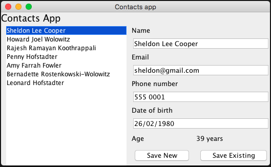

# Java: Swing GUIs

The following tutorial assumes you are using [Jetbrains IntelliJ IDEA](jetbrains.com/idea/). Please download and install that if you don't already have it before continuing.

The massive advantage of using a proper Java IDE is that it allows you to create Swing GUI's via a drag-and-drop interface. It is a lot less hassle than coding it each element in Java individually!

Please adjust the following setting in IntelliJ, it will turn off a feature that causes no end of confusion with my students:

* Settings / Editor / General / Appearance / Show parameter name hints: OFF

## Part 1 - Introduction

A quick introduction to the demonstration project we will build. It is a contacts manager that will look like this...



* [Video 1](https://youtu.be/r03gsOv4O84) (1:48)

## Part 2 - Create the GUI

Use the drag-and-drop GUI builder to make our screen.

* [Video 2](https://youtu.be/jvtDm4vcV7w) (8:01)

## Part 3 - Code Person class

Write the Person class we will use as the basis of the data in this project.

* [Video 3](https://youtu.be/dm4ICrqOcj8) (6:44)

## Part 4 - Code JFrame

Program the JFrame to visualise.

* [Video 4](https://youtu.be/cTOeHFwG_wg) (4:44)

## Part 5 - Populate JList

Program the list to display an entry for each person, and to refresh it's list when we require it.

* [Video 5](https://youtu.be/lRupi3iJmzk) (12:46)

Copy and paste the demo data I used if you wish...

```java
Person sheldon = new Person("Sheldon Lee Cooper", "sheldon@gmail.com", "555 0001", "26/02/1980");
Person howard = new Person("Howard Joel Wolowitz", "howard@gmail.com", "555 0002", "01/03/1981");
Person bernadette = new Person("Bernadette Rostenkowski-Wolowitz", "bernadette@gmail.com", "555 0002", "01/01/1984");
Person raj = new Person("Rajesh Ramayan Koothrappali", "raj@gmail.com", "555 0003", "06/10/1981");
Person penny = new Person("Penny Hofstadter", "penny@gmail.com", "555 0004", "02/12/1985");
Person leonard = new Person("Leonard Hofstadter", "leonard@gmail.com", "555 0004", "17/05/1980");
Person amy = new Person("Amy Farrah Fowler", "amy@gmail.com", "555 0005", "17/12/1979");
```

## Part 6 - JList selection action

Program the list so that when an item is selected, it populates the respective textFields with information about that person.

* [Video 6](https://youtu.be/tRJtoz8ZobA) (8:18)

## Part 7 - JButton selection action

Program the buttons to save a new person or update an existing one to the *people* ArrayList. 

* [Video 7](https://youtu.be/zRDP1UENJdQ) (10:34)

## Part 8 - Refactor code

Reorganise some of the code to (hopefully) make it more intuitive for beginner programmers.

* [Video 8](https://youtu.be/84GhcXn_p-I) (8:26)

## Extension task: Persistent data

Here is the JSON data you can save to a file. I suggested at the end of video 7 to attempt to load this data from a data file instead of hard coding it. Refer to my [JSON notes](/java/json) for more on this.

```json
[
  {"phoneNumber":"555 0001","dateOfBirthString":"26/02/1980","name":"Sheldon Lee Cooper","dateOfBirth":"1980-02-26","age":39,"email":"sheldon@gmail.com"},
  {"phoneNumber":"555 0002","dateOfBirthString":"01/03/1981","name":"Howard Joel Wolowitz","dateOfBirth":"1981-03-01","age":38,"email":"howard@gmail.com"},
  {"phoneNumber":"555 0003","dateOfBirthString":"06/10/1981","name":"Rajesh Ramayan Koothrappali","dateOfBirth":"1981-10-06","age":37,"email":"raj@gmail.com"},
  {"phoneNumber":"555 0004","dateOfBirthString":"02/12/1985","name":"Penny Hofstadter","dateOfBirth":"1985-12-02","age":33,"email":"penny@gmail.com"},
  {"phoneNumber":"555 0005","dateOfBirthString":"17/12/1979","name":"Amy Farrah Fowler","dateOfBirth":"1979-12-17","age":39,"email":"amy@gmail.com"},
  {"phoneNumber":"555 0002","dateOfBirthString":"01/01/1984","name":"Bernadette Rostenkowski-Wolowitz","dateOfBirth":"1984-01-01","age":35,"email":"bernadette@gmail.com"},
  {"phoneNumber":"555 0006","dateOfBirthString":"17/05/1980","name":"Leonard Hofstadter","dateOfBirth":"1980-05-17","age":38,"email":"leonard@gmail.com"}
]
```

## Extension task: Photos

Here's a [tutorial](https://www.geeksforgeeks.org/jlabel-java-swing/) that's a helpful tip on how to get started.

This is the look you are aiming for...


## Extension: Build the completed JAR

Turning your completed project into a JAR file makes it distributable!

* File -> Project Structure -> Project Settings -> Artifacts -> Click green plus sign -> Jar -> From modules with dependencies...

The above sets the "skeleton" to where the jar will be saved to. To actually build and save it do the following:

* Extract to the target Jar
* OK
* Build -> Build Artifact

[source](https://stackoverflow.com/a/4901370)

## Completed project

* [Swing demo source code](teacher/swing-demo.pdf) (restricted)
