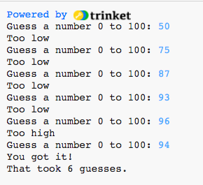

# 1.8 - Repeating instructions using "while"

The while loop works very similar to the if statement. The difference being that so long as something is true, it will keep running the same indented section of code. An example:

```javascript
console.log("I will count from 1 to 10");
let num = 1;
while (num <= 10) {
   console.log( num );
   num = num + 1;
}
console.log("The end!");
```

## Exercise: Guessing game

Another new trick is to get the computer to pick a random number for us. The two lines of the code below will pick a random number between 0 and 100.

```javascript
let r = Math.trunc( Math.random() * 100 );
```

Using this random number generating trick, create a little program where:

* The computer picks a random number and stores it as a secret number
* Ask the user to guess the number
* If the guess is higher than the secret number, print the message "too high"
* If the guess is lower than the secret number, print the message "too low"
* If the guess is correct, print the message "you are correct!"
* To use a while loop to keep the game going until the correct guess has been made
* Bonus points: Can you keep count of the number of guesses it takes the player to get it correct?

Screen shot of the finished product:



## Exercise: Fibonacci

The fibonacci sequence is created by summing the two previous numbers together. The first 10 numbers in the sequence are 1, 1, 2, 3, 5, 8, 13, 21, 34, 55.

Use a `while()` loop to create a program that will calculate the n-th number of the sequence. For instance, if asked for the 8th number, it should provide the answer of 21.

---
