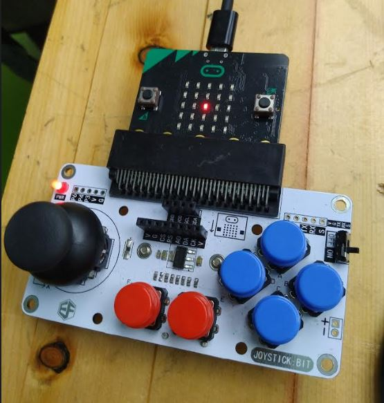

# Joystick Bit




For the blue and red buttons, read the `pin2.read_analog()` and check the values as follows...

* < 256 ... Blue UP button
* < 597 ... Blue RIGHT button
* < 725 ... Blue DOWN button
* < 793 ... Blue LEFT button
* < 836 ... Red LEFT button
* < 938 ... Red RIGHT button

For the joystick, `pin0.read_analog()` gives you the x-coordinate and `pin1.read_analog()` gives you the y-coordinate. Both values will range from 0 to 1000 where 500 is the resting point.

Demo code...

```python
from microbit import *

while True:
    buttons = pin2.read_analog() 
    x = pin0.read_analog()
    y = pin1.read_analog()

    # Example functionality
    if buttons < 256:           # Blue UP
        display.show(Image.ARROW_N)
    elif buttons < 597:         # Blue RIGHT
        display.show(Image.ARROW_E)
    elif buttons < 725:         # Blue DOWN
        display.show(Image.ARROW_S)
    elif buttons < 793:         # Blue LEFT
        display.show(Image.ARROW_W)
    elif buttons < 836:         # Red LEFT
        display.show(Image.DUCK)
    elif buttons < 938:         # Red RIGHT
        display.show(Image.HAPPY)
    else:                   # No button pressed
        col = int( x // 250 ) # Convert 0...1000 to 0..4
        row = 4 - int( y // 250 ) # Convert 0...1000 to 0..4
        display.clear()
        display.set_pixel(col,row,9)
    sleep(100)
```

Product website:

* https://www.elecfreaks.com/estore/elecfreaks-joystick-bit-for-micro-bit.html
