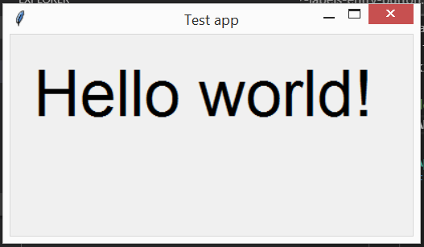
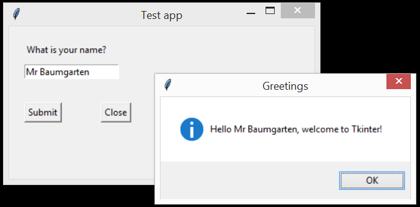
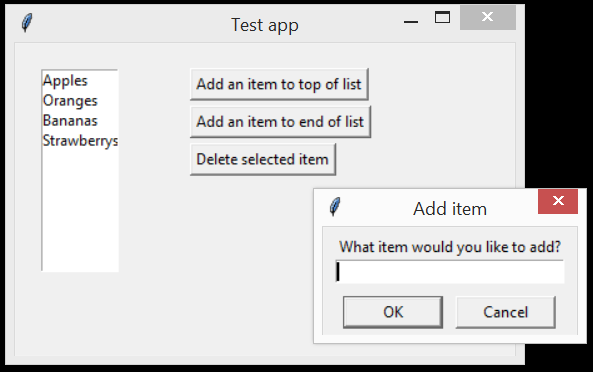
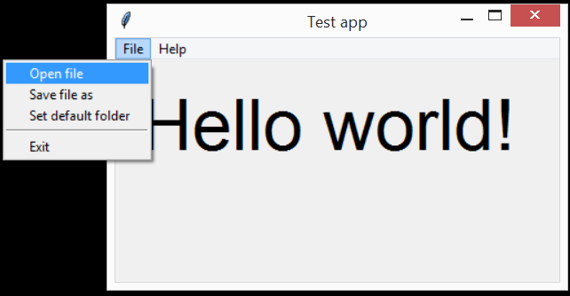
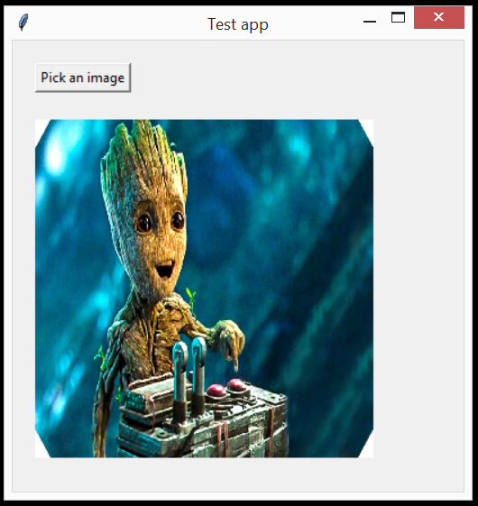
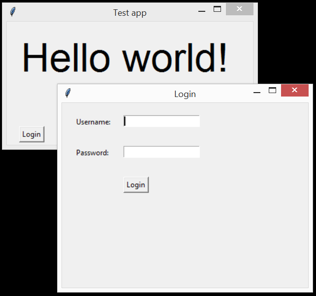
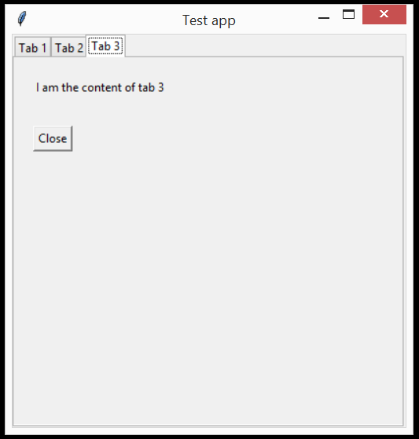

# Tkinter GUI

## Contents

1. [Starting a basic app](#a-basic-app)
2. [Label, entry box and button](#labels-entry-box-button)
3. [Listbox and simpledialog](#listbox-simpledialog)
4. [Menubar and filedialog](#menubar-filedialog)
5. [Images](#images)
6. [Second window](#second-window)
7. [Tabs](#tabs)
8. [Assorted tips and tricks](#tips-and-tricks)
8. [Suggested resources](#suggested-resources)

<div class="page"/>

## A basic app



* Video: [A quick intro to Tkinter and object orientated programming](https://youtu.be/olxgc9F8mzk)

```python
import tkinter as tk
from tkinter import ttk

# Pre-define some defaults
FONT_LARGE = ("Arial", 48)

class AppWindow():
    def __init__(self, parent):
        # Create the window
        self.window = parent
        self.window.geometry("400x200")
        self.window.title("Test app")
        self.window.protocol("WM_DELETE_WINDOW", self.window.quit) # Enable the close icon
        # Create a text label and place it in the window
        self.hello_label = tk.Label(self.window, text="Hello world!", font=FONT_LARGE)
        self.hello_label.place(x=20, y=20)

if __name__ == "__main__":
    root = tk.Tk()
    app = AppWindow(root)
    root.mainloop()
```

<div class="page"/>

## Labels, entry box, button


* Video: [Using buttons in Tkinter](https://youtu.be/MoyIk66vlmk)
* Video: [Using entry textbox in Tkinter](https://youtu.be/4dN5Ef4rTzo)




```python
import tkinter as tk
from tkinter import ttk
from tkinter import messagebox

# Pre-define some defaults
FONT_LARGE = ("Arial", 48)

class AppWindow():
    def __init__(self, parent):
        # Create the window
        self.window = parent
        self.window.geometry("400x200")
        self.window.title("Test app")
        # Create a text label
        self.question_label = tk.Label(self.window, text="What is your name?")
        self.question_label.place(x=20, y=20)
        # Create a text entry box
        self.name_entry = tk.Entry(self.window)
        self.name_entry.place(x=20, y=50)
        self.name_entry.focus()   # Put the cursor in the text box
        # Create a button
        self.submit_button = tk.Button(self.window, text="Submit", command=self.greetings)
        self.submit_button.place(x=20, y=100)
        # Create a second button
        self.close_button = tk.Button(self.window, text="Close", command=self.window.quit)
        self.close_button.place(x=120, y=100)

    def greetings(self):
        # This function is executed when the submit button is clicked
        # Retrieve the text from the entry box
        person = self.name_entry.get()
        # Display a message box
        messagebox.showinfo("Greetings", f"Hello {person}, welcome to Tkinter!")

if __name__ == "__main__":
    root = tk.Tk()
    app = AppWindow(root)
    root.mainloop()
```

<div class="page"/>

## Listbox, simpledialog



```python
import tkinter as tk
from tkinter import ttk
from tkinter import messagebox
from tkinter import simpledialog

# Pre-define some defaults
FONT_LARGE = ("Arial", 48)

# List of items to demo listbox
items = ["Apples", "Oranges", "Bananas", "Strawberrys"]

class AppWindow():
    def __init__(self, parent):
        # Create the window
        self.window = parent
        self.window.geometry("400x250")
        self.window.title("Test app")
        # Create a list box
        # -- width is characters, height is lines
        self.list = tk.Listbox(self.window, width=10, height=10)    
        for item in items:
            # Add each item to the end of the list
            self.list.insert(tk.END, item)                     
        self.list.place(x=20, y=20)
        # -- When an item in the list is selected, execute the list_clicked function
        self.list.bind('<<ListboxSelect>>', self.list_clicked) 
        # -- Give `selected` a default of -1
        self.selected = -1                                     
        # Create some buttons
        self.add_to_top_button = tk.Button(self.window, text="Add an item to top of list", command=self.add_to_top_clicked)
        self.add_to_top_button.place(x=140, y=20)
        self.add_to_end_button = tk.Button(self.window, text="Add an item to end of list", command=self.add_to_end_clicked)
        self.add_to_end_button.place(x=140, y=50)
        self.close_button = tk.Button(self.window, text="Delete selected item", command=self.delete_selected_clicked)
        self.close_button.place(x=140, y=80)

    def add_to_top_clicked(self):
        answer = simpledialog.askstring("Add item","What item would you like to add?")
        self.list.insert(0, answer)

    def add_to_end_clicked(self):
        answer = simpledialog.askstring("Add item","What item would you like to add?")
        self.list.insert(tk.END, answer)

    def delete_selected_clicked(self):
        if self.selected >= 0:      # Check this still isn't -1
            self.list.delete(self.selected)
            self.selected = -1      # Reset back to -1
        else:
            messagebox.showerror("Error", "Can't delete the selected item if you haven't selected anything!")

    def list_clicked(self, e):
        print(e)
        self.selected = int(self.list.curselection()[0])      # item number selected in list
        item = self.list.get(self.selected)                   # text of selected item
        print(f"You have clicked item {self.selected} which is {item}")

if __name__ == "__main__":
    root = tk.Tk()
    app = AppWindow(root)
    root.mainloop()
```

<div class="page"/>

## Menubar, filedialog



```python
import tkinter as tk
from tkinter import ttk
from tkinter import messagebox
from tkinter import filedialog

# Pre-define some defaults
FONT_LARGE = ("Arial", 48)
ALLOWED_FILES = (("JPEG files","*.jpg"),("PNG files","*.png"),("all files","*.*"))

class AppWindow():
    def __init__(self, parent):
        # Create the window
        self.window = parent
        self.window.geometry("400x200")
        self.window.title("Test app")
        # Create a text label and place it in the window
        self.hello_label = tk.Label(self.window, text="Hello world!", font=FONT_LARGE)
        self.hello_label.place(x=20, y=20)
        # Create a menu bar
        menubar = tk.Menu(self.window)
        filemenu = tk.Menu(menubar, tearoff=0)
        filemenu.add_command(label="Open file", command=self.file_open)
        filemenu.add_command(label="Save file as", command=self.file_saveas)
        filemenu.add_command(label="Set default folder", command=self.select_folder)
        filemenu.add_separator()
        filemenu.add_command(label="Exit", command=self.window.quit)
        helpmenu = tk.Menu(menubar, tearoff=0)
        helpmenu.add_command(label="About", command=self.about)
        menubar.add_cascade(label="File", menu=filemenu)
        menubar.add_cascade(label="Help", menu=helpmenu)
        self.window.config(menu=menubar)
        # Intialise the default folder location
        self.default_folder = "."

    def file_open(self):
        filename = filedialog.askopenfilename(initialdir=self.default_folder, title="Select file", filetypes=ALLOWED_FILES)
        print(f"Open file: {filename}")

    def file_saveas(self):
        filename = filedialog.asksaveasfilename(initialdir=self.default_folder, title="Select file", filetypes=ALLOWED_FILES)
        print(f"Save file as: {filename}")

    def select_folder(self):
        folder = filedialog.askdirectory(initialdir=self.default_folder, title = "Select folder containing student photos")
        self.default_folder = folder
        print(f"New default folder: {folder}")

    def about(self):
        messagebox.showinfo("About", "Copyright (c) 2019 Paul Baumgarten\nWebsite: pbaumgarten.com")

if __name__ == "__main__":
    root = tk.Tk()
    app = AppWindow(root)
    root.mainloop()
```

<div class="page"/>

## Images




```python
import tkinter as tk
from tkinter import filedialog
from PIL import Image, ImageTk

# Pre-define some defaults
FONT_LARGE = ("Arial", 48)
ALLOWED_FILES = (("JPEG files","*.jpg"),("PNG files","*.png"),("all files","*.*"))

class AppWindow():
    def __init__(self, parent):
        # Create the window
        self.window = parent
        self.window.geometry("400x400")
        self.window.title("Test app")
        # Button
        self.pick_file_button = tk.Button(self.window, text="Pick an image", command=self.show_image)
        self.pick_file_button.place(x=20,y=20)
        # Create a label reserved for displaying image later
        self.image_label = tk.Label(self.window)
        self.image_label.place(x=20,y=70,width=300,height=300)

    def show_image(self):
        # Get image selection
        filename = filedialog.askopenfilename(title="Select image", filetypes=ALLOWED_FILES)
        print(f"Opening file: {filename}")
        # Open the image file
        img = Image.open(filename)
        # (optional) resize the image
        img = img.resize((300, 300))        
        # 1. Reformat the image into tk compatible form, and
        # 2. Save a copy of the image to self otherwise it will be cleared from memory when this function closes
        self.tkimg = ImageTk.PhotoImage(img)
        # Display the image in the label
        self.image_label.configure(image=self.tkimg)

if __name__ == "__main__":
    root = tk.Tk()
    app = AppWindow(root)
    root.mainloop()
```

<div class="page"/>

## Second window



To have Tkinter open second windows, use the `tk.Toplevel()` function as shown in the `LoginWindow.__init__()` function.

With respect to organising your code, it is generally good practice to make each window its own class.

```python
import tkinter as tk
from tkinter import ttk
import time

# Pre-define some defaults
FONT_LARGE = ("Arial", 48)

class LoginWindow():
    def __init__(self, parent):
        # Create a variable with which we can reference our parent
        self.parent = parent
        # Secondary windows are made using tk.Toplevel() instead of using parent
        self.window = tk.Toplevel()
        self.window.geometry("400x300")
        self.window.title("Login")
        # Labels
        self.username_label = tk.Label(self.window, text="Username:")
        self.username_label.place(x=20,y=20)
        self.password_label = tk.Label(self.window, text="Password:")
        self.password_label.place(x=20,y=70)
        # Entry boxes
        self.username_text = tk.Entry(self.window)
        self.username_text.place(x=100,y=20)
        self.username_text.focus()
        self.password_text = tk.Entry(self.window, show="*")
        self.password_text.place(x=100,y=70)
        # Button
        self.login_button = tk.Button(self.window, text="Login", command=self.login)
        self.login_button.place(x=100,y=120)

    def login(self):
        self.userid = self.username_text.get()
        self.passwd = self.password_text.get()
        print(f"Your username is {self.userid} and password is {self.passwd}")
        # Close the login window
        self.window.destroy()  

    def get_info(self):
        return self.userid, self.passwd

class AppWindow():
    def __init__(self, parent):
        # Create the window (linked to the app parent)
        self.window = parent
        self.window.geometry("400x200")
        self.window.title("Test app")
        # Create a text label and place it in the window
        self.hello_label = tk.Label(self.window, text="Hello world!", font=FONT_LARGE)
        self.hello_label.place(x=20, y=20)
        # Create a button
        self.login_button = tk.Button(self.window, text="Login", command=self.login_clicked)
        self.login_button.place(x=20, y=170)
    
    def login_clicked(self):
        # Create login window        
        login_window = LoginWindow()
        # Wait until the login window is closed
        self.window.wait_window(login_window.window)  
        print("Finished waiting")
        uid, pwd = login_window.get_info()
        self.hello_label.configure(text=f"Hello {uid}")

if __name__ == "__main__":
    root = tk.Tk()
    app = AppWindow(root)
    root.mainloop()
```

<div class="page"/>

## Tabs



```python
import tkinter as tk
from tkinter import ttk
from tkinter import messagebox

class AppWindow():
    def __init__(self, parent):
        # Create the window
        self.window = parent
        self.window.geometry("400x400")
        self.window.title("Test app")
        # Create a text label and place it in the window
        self.hello_label = tk.Label(self.window, text="Hello world!", font=FONT_LARGE)
        self.hello_label.place(x=20, y=20)
        # Create 3 tabs
        self.tab_container = tk.Frame(self.window)
        self.tab_container.place(x=0,y=0,width=400,height=400)
        self.tabs = ttk.Notebook(self.tab_container)
        self.tab_1 = tk.Frame(self.tabs)
        self.tab_2 = tk.Frame(self.tabs)
        self.tab_3 = tk.Frame(self.tabs)
        self.tabs.add(self.tab_1, text="Tab 1")
        self.tabs.add(self.tab_2, text="Tab 2")
        self.tabs.add(self.tab_3, text="Tab 3")
        self.tabs.place(x=0,y=0,height=400,width=400)
        # Define what function to run when current tab is changed
        self.tabs.bind("<<NotebookTabChanged>>", self.on_tab_selected)
        # Content for tab 1
        self.label1 = tk.Label(self.tab_1, text="I am the content of tab 1")
        self.label1.place(x=20, y=20) # Coordinates are relative to within the tab area    
        # Content for tab 2
        self.label2 = tk.Label(self.tab_2, text="I am the content of tab 2")
        self.label2.place(x=20, y=20) # Coordinates are relative to within the tab area
        # Content for tab 3
        self.label3 = tk.Label(self.tab_3, text="I am the content of tab 3")
        self.label3.place(x=20, y=20) # Coordinates are relative to within the tab area
        self.close_button = tk.Button(self.tab_3, text="Close", command=self.close_clicked)
        self.close_button.place(x=20,y=70)

    def on_tab_selected(self, e):
        # Function to execute whenever current tab is changed
        selected_tab = e.widget.select()
        tab_text = e.widget.tab(selected_tab, "text")
        if tab_text == "Tab 1":
            print("You clicked into tab 1")
        if tab_text == "Tab 2":
            print("You clicked into tab 2")
        if tab_text == "Tab 3":
            print("You clicked into tab 3")

    def close_clicked(self):
        result = messagebox.askyesno("Confirm", message="Do you want to quit?")
        if result:
            self.parent.quit()

if __name__ == "__main__":
    root = tk.Tk()
    app = AppWindow(root)
    root.mainloop()
```

<div class="page"/>

## Tips and tricks

A few little discoveries I've made along the way of building a few projects...

Execute a function (in this case, `self.window.quit()`) when the window close icon is clicked

```python
self.window.protocol("WM_DELETE_WINDOW", self.window.quit)
```

Make the window partially transparent

```python
self.window.attributes('-alpha', 0.8)
```

Force the window to stay visibly on top of all other programs

```python
root.wm_attributes("-topmost", 1)
```

Any other useful little tricks that should be added here? Let me know!

## Suggested resources

* https://python-textbok.readthedocs.io/en/1.0/Introduction_to_GUI_Programming.html
* http://www.effbot.org/tkinterbook/grid.htm
* https://docs.python.org/3.7/library/tkinter.html
* https://www.python-course.eu/python_tkinter.php

